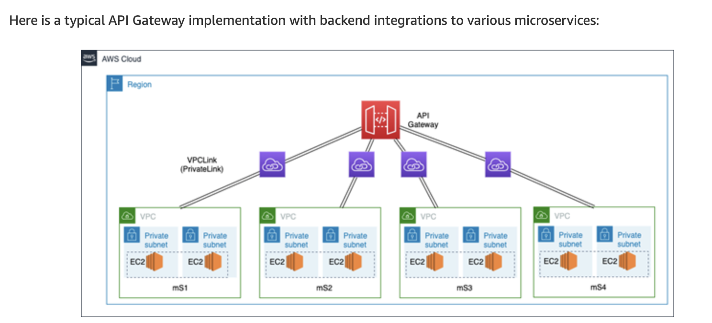
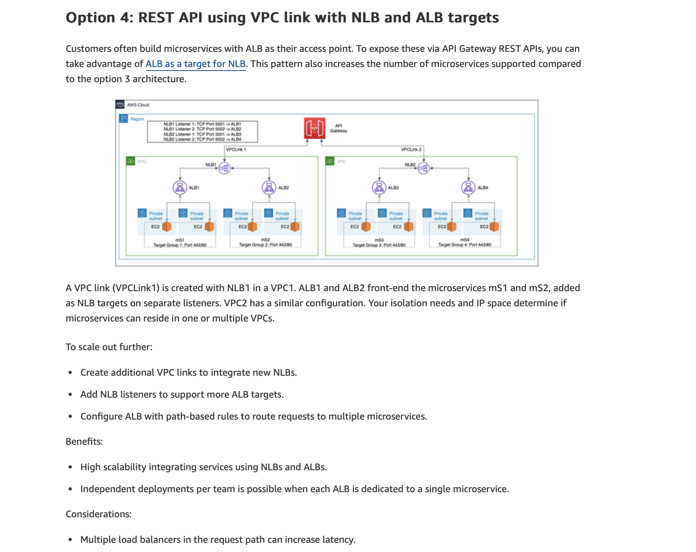
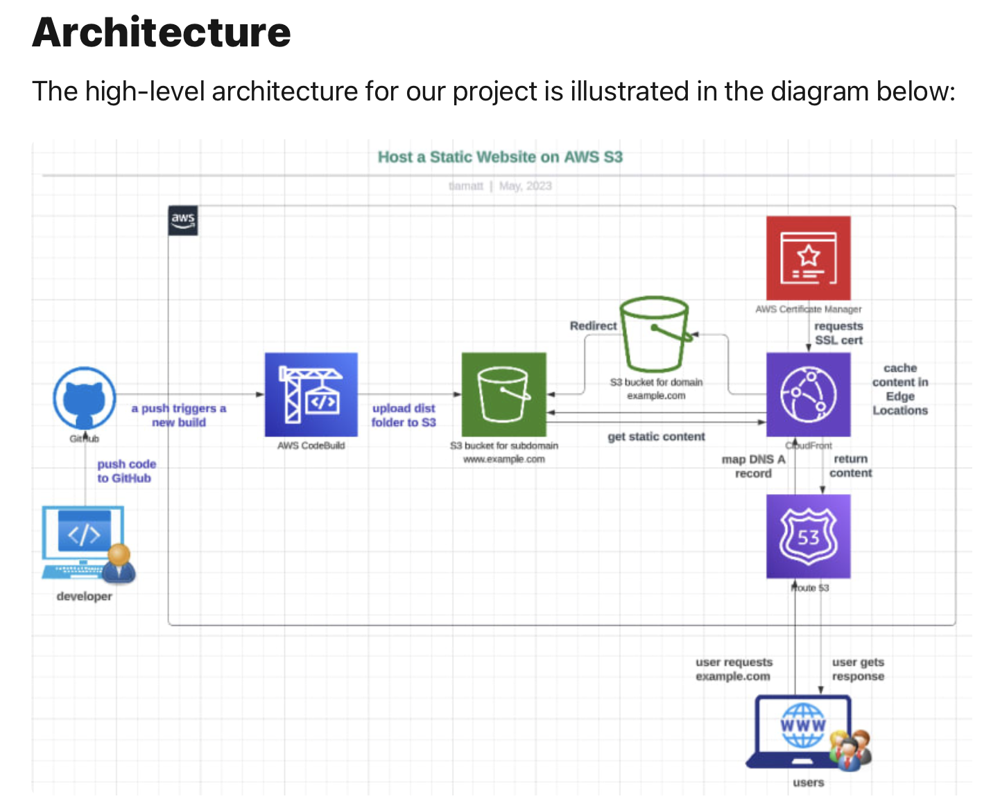

# IaC
The Solid Network Bank Infrastructure as code (IaC)

## Architecture 


### REST API Gateway to EC2

Api Gateway > Method > Http Integration > url EC2

- VPC > SUBNET > INTERNET GATEWAY > ROUTE TABLE > ROUTE + IGTW > SEC GROUP (22,443,80) > EC2 (SECGROUP + SUBNET)





### User - Website Architecture

| User | --> | Cloudflare | --> | CloudFront | --> | S3 Bucket | 

### Developer - Website Architecture 

| Developer | --> | GitHub | --> | AWS CodeBuild | --> | S3 Bucket |

### DevOps - Website Architecture 

| DevOps | --> | GitHub | --> | AWS CLI | --> | Stack: CloudFront + AWS Certificate + S3 Bucket + Static Page |

## [Create IAM users](https://github.com/solidnetwork-bank/IaC/tree/main/Readme/setup.md)

## Hosts, APIs and Microservices

### Homepage Site (Frontend)
**Host**:
```sh
bank.solidnetwork.xyz
```

### Protected Site (Frontend)
**Host**:
```sh
online.solidnetwork.xyz
```

### Sign Up. Sign In. Log Out. Forgot username. Forgot password .Profile .Settings.
**Host**:
```sh
secure.solidnetwork.xyz
```
**Rest Api**:
- **Secure Rest Api**
- **Methods**:
```sh
'POST /auth/signin' - Sing In (GENERATE JWT TOKEN)
```
```sh
'POST /auth/singup' - Sing Up
```
```sh
'POST /auth/logout' - Log Out
```
```sh
'POST /profile' - READ PROFILE INFORMATION
```
```sh
'POST /settings' - Settings
```
**Microservices:**
- **secure-service:** 

### Transfers.
**Host**:
```sh
transfer.solidnetwork.xyz
```
**Rest Api**:
- **Transfer Rest Api**
- **Methods**:
```sh
'POST /' - LIST ALL TRANSFERS
```
```sh
'POST /self' - BETWEEN MY ACCOUNTS
```
```sh
'POST /wallet' - ZELLE
```
```sh
'POST /wire' - INTERNATIONAL
```
**Microservices:**
- **transfer-service:** 

### Payments.
**Host**:
```sh
payment.solidnetwork.xyz
```
**Rest Api**:
- **Payment Rest Api**
- **Methods**:
```sh
'POST /' - LIST ALL PAYMENTS
```
```sh
'POST /bill' - Pay Bills
```
**Microservices:**
- **payment-service:** 

### Investment. CD.
**Host**:
```sh
investment.solidnetwork.xyz
```
**Rest Api**:
- **Investment Rest Api**
- **Methods**:
```sh
'POST /' - LIST ALL INVESTMENTS
```
```sh
'POST /cd' - Certificate of Deposit
```
**Microservices:**
- **investment-service:** 

### Loans.
**Host**:
```sh
loan.solidnetwork.xyz
```
**Rest Api**:
- **Loan Rest Api**
- **Methods**:
```sh
'POST /' - LIST ALL LOANS
```
```sh
'POST /home' - Mortgage
```
```sh
'POST /auto' - Car Loans
```
**Microservices:**
- **loan-service:** 

### Statements. Documents.
**Host**:
```sh
statement.solidnetwork.xyz
```
**Rest Api**:
- **Statement Rest Api**
- **Methods**:
```sh
'POST /' - LIST ALL STATEMENTS
```
```sh
'POST /generate' - (GENERATE PDF STATEMENT)
```
**Microservices:**
- **statement-service:** 
### Accounts. Joint Account. Savings Account. Checking Account.
**Host**:
```sh
account.solidnetwork.xyz
```
**Rest Api**:
- **Account Rest Api**
- **Methods**:
```sh
'POST /' - (LIST ALL ACCOUNTS)
```
```sh
'POST /transaction' - (READ ACCOUNT TRANSACTIONS)
```
```sh
'POST /transaction/detail' - (READ TRANSACTION DETAIL)
```
**Microservices:**
- **account-service:** 

### Cards. Debit Cards. Credit Cards.
**Host**:
```sh
card.solidnetwork.xyz
```
**Rest Api**:
- **Card Rest Api**
- **Methods**:
```sh
'POST /' - LIST ALL CARDS (ACTIVATED STATUS, LAST 4 DIGITS)
```
```sh
'POST /detail' - READ A CARD (CARD DETAIL)
```
```sh
'POST /request' - REQUEST A NEW CREDIT CARD (CREDIT CARD ONLY)
```
```sh
'POST /replace' - REPLACE A CARD (DAMAGED OR STOLEN: UPDATE TO DISACTIVATED STATUS)
```
```sh
'POST /lock' - LOCK AND UNLOCK A CARD
```
**Microservices:**
- **card-service** 